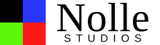
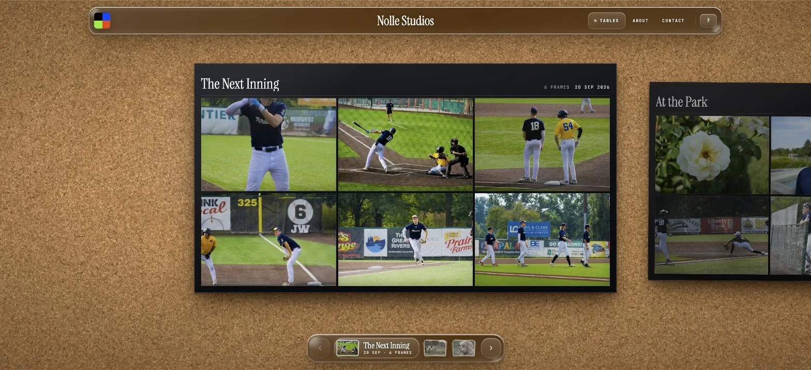
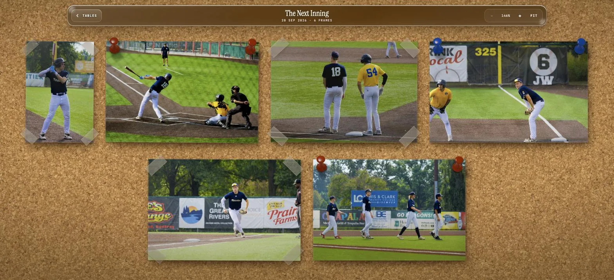
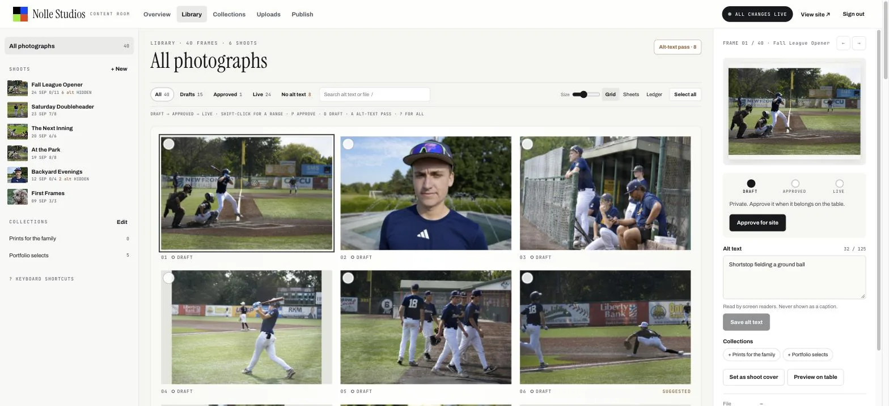
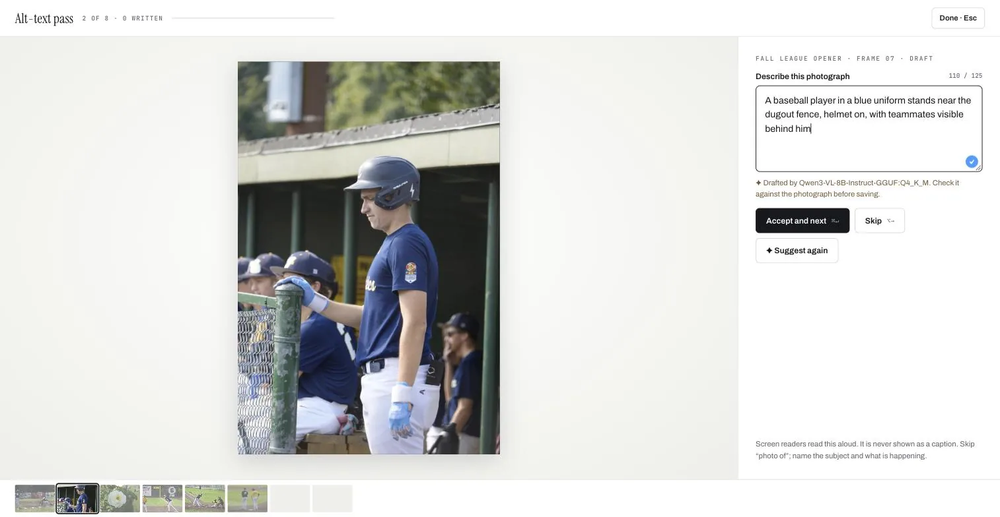

<p align="center">
  <picture>
    <source media="(prefers-color-scheme: dark)" srcset="public/nolle-studios-header-on-dark.svg">
    
  </picture>
</p>

<p align="center">
  A photography portfolio laid out like prints on a light table.<br>
  <a href="https://nollestudios.com"><b>nollestudios.com</b></a>
</p>

<p align="center">
  
</p>

Every shoot is a contact sheet on a cork board, newest first. Open one and its prints are pinned and taped to the board to pan, zoom, and inspect under a loupe. Behind it is the **Content Room**, a private, self-hosted CMS for uploads, sequencing, publishing, and alt text written by a local vision model.

<table>
  <tr>
    <td width="50%"></td>
    <td width="50%"></td>
  </tr>
  <tr>
    <td align="center"><sub>The shoot board: every print fitted to the screen</sub></td>
    <td align="center"><sub>The Content Room library</sub></td>
  </tr>
</table>

## What's inside

**The light table.** Contact sheets slide past under a liquid-glass header and a transport of shoot covers. Scroll, swipe, or use the arrow keys to move between shoots; click a frame to open its board. On the board, prints hang by clear tape or push pins, and no two neighbours hang the same way. Drag to pan, and scroll or pinch to zoom from the fitted view down to fine detail. A loupe follows the pointer, and the print preview zooms to full resolution. Press **Select** (or `S`) to tick several photographs and download them as one ZIP, built in the browser; the preview downloads a single photograph (`D`). `?` lists every key.

**Everything is rendered, nothing is stock.** The cork, the liquid-glass rims, the loupe, the push pins, and the tape are Blender scenes in [`art/`](art/README.md), rendered on the GPU with Cycles. The glass bends what is behind it: a normal map rendered from the same glass slab drives an SVG displacement filter, so the cork and photographs refract at the rim (Chromium; Safari and Firefox show frosted glass).

**The Content Room.** A private editor at `/admin/` for shoots, collections, uploads, and ordering. Photographs move from Draft to Approved to Live, and nothing reaches visitors until **Publish**. Uploads are resized to AVIF, WebP, and JPEG from 640 to 3200 px with EXIF, GPS, and XMP removed. Videos are transcoded to 720p and 1080p.

<p align="center">
  
</p>

**Alt text from a local model.** A vision model running on your own machine ([Qwen3-VL 8B](https://huggingface.co/unsloth/Qwen3-VL-8B-Instruct-GGUF) through `llama.cpp`) drafts a description for every upload without alt text. Drafts are suggestions only: the alt-text pass shows each photograph with its draft, and nothing is saved until you accept or correct it. No photograph leaves the server.

**Fast by default.** The site is SolidJS, under 70 KB of JavaScript, with the table code split off and fetched while the catalog loads. Images are served as AVIF first, sized to the zoom they are shown at. Animation loops run only while something moves. Fonts are self-hosted Latin subsets. The CMS is Hono on Node's built-in TypeScript support, with no build step.

## Stack

| | |
| --- | --- |
| Site and Content Room | [SolidJS](https://www.solidjs.com), TypeScript, [Vite](https://vite.dev) |
| CMS | [Hono](https://hono.dev) on Node.js 26 (native TypeScript), SQLite locally or PostgreSQL, S3-compatible storage (R2, B2) |
| Media | [sharp](https://sharp.pixelplumbing.com) for images, FFmpeg for video |
| Alt text | [llama.cpp](https://github.com/ggml-org/llama.cpp) serving Qwen3-VL on `127.0.0.1` |
| Art | [Blender](https://www.blender.org) 5.2, Cycles on the GPU |
| Deployment | GitHub Pages for the static site; Docker Compose with Caddy for the CMS |

## Run it locally

Requires Node.js 26, FFmpeg for video uploads, and optionally `llama-server` (`brew install llama.cpp`) for alt-text drafts.

```bash
npm install
cp .env.example .env        # set CMS_ADMIN_PASSWORD
npm run dev:cms             # the CMS on 127.0.0.1:8788
npm run dev                 # the site and Content Room on 127.0.0.1:5173
npm run alt:model           # optional: the local alt-text model on 127.0.0.1:8790
```

Open [127.0.0.1:5173](http://127.0.0.1:5173/) for the light table and [127.0.0.1:5173/admin/](http://127.0.0.1:5173/admin/) for the Content Room. The first `alt:model` run downloads the model (about 5 GB).

| Command | |
| --- | --- |
| `npm run build` | Build the site (`dist/`) and the Content Room (`dist-admin/`) |
| `npm run build:static` | Build the static GitHub Pages site from `public/media/archive.json` |
| `npm test` | CMS, static build, and board layout tests |
| `npm run typecheck` | Type-check the browser and server projects |
| `npm run cms:hash` | Hash an admin password for production |

## Layout

```
src/            the light table (SolidJS)
  table/        board, preview, loupe, glass refraction, layout maths
admin/          the Content Room (SolidJS)
server/         the CMS: API, auth, media pipeline, publishing, alt-text drafts
shared/         API types shared by the browser and the server
art/            Blender scenes and finishing scripts for every texture and sprite
public/media/   published photographs and their manifest
infra/          Dockerfiles and Caddy configuration
docs/           CMS, publishing, and release notes
```

## Documentation

- [Content Room and CMS deployment](docs/CMS.md): uploads, publishing, alt-text drafting, the API, and Docker Compose
- [Publishing the static site](docs/PUBLISH.md): building and releasing to GitHub Pages
- [Media workshop](art/README.md): exporting photographs and rendering the Blender art
- [Release checks](docs/QA.md)

Photographs © Nolle Studios. All rights reserved.
